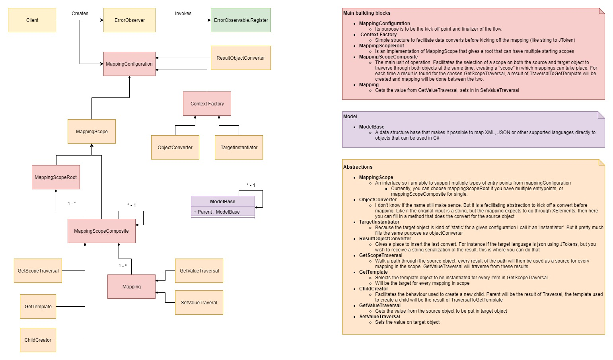

# AdaptableMapper

A package for any to any mapping without hardcoding.
The implementation is set up with storage in mind through serialization. I use newtonsoft for serializing the composite for storage (see object JsonSerializer)
But ofcourse you can use your own methods for storage!

## I'd like your help!

Simply put, do what you want with my code, help me build it, test it, and help it grow, my goal is to spread this idea, and hopefully make the lives of programmers in companies that are build around API intergrations allot easier!
I've worked for a few companies that all struggle with integrations. I think i've found a simple yet useful concept that elevates the configuration of mapping from hardcoding to softcoding.
This package is only an abstract representation of that idea. Storage of configuration and giving it actual meaning is up to you. And I hope with you and your experience this idea can grow!

So please, ask questions, give feedback, make comments, create pullrequests!
Copy my code, install my packages, use it for yourself and help it grow. :)

## Roadmap

Completed plans:
 - Create an algorithm flexible enough to support any to any conversion
 - Soft error handling (through observer)
 - Implement Xml mapping
 - Implement Model mapping
 - Implement Json mapping
 - Add null checks for the composite tree
 - Write documentation

Current plans:
 - Add 100% code coverage tests for Model Mapping

Future plans in relative priority order:
 - Add 100% code coverage tests for Xml Mapping
 - Add 100% code coverage tests for Json Mapping

### Prerequisites

As long as I'm in alpha, Ill only build the package for .NET framework.
After I feel confident the package is stable I will research how to deploy for .NET standard (I think that includes .NET Core or visa versa)

### Installing

See installation instructions on nuget.org where the package is hosted:
```
https://www.nuget.org/packages/AdaptableMapper/
```

### How to use

Mock up of structure and flow:



See unit tests for examples on mappingConfiguration

### Versioning

I use [SemVer](http://semver.org/) for versioning. (I've got no clue on what that says for alpha releases, so when I reach 1.0.0 Ill start using SemVer, for now 0.X.0 will be used for breaking changes, 0.0.X will be used for bugfixes or non-breaking changes)

### Authors

* **Davey van Tilburg**

### License

See the [License.txt](AdaptableMapper/License.txt) file for details.
Do what ever the f*** you want! (But please respect eachother in the process)

### Acknowledgments

* Newtonsoft for json serialization
* SmartHOTEL, the company I work for currently, where I can put the package to use and see a product grow. The first usecase.